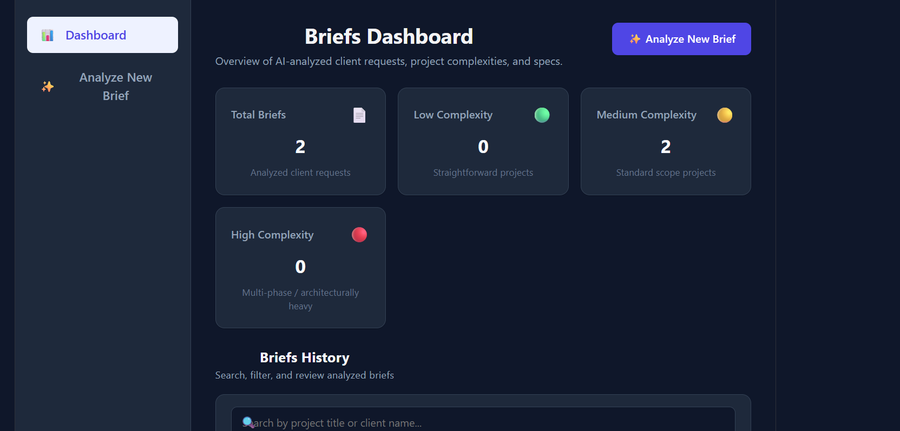
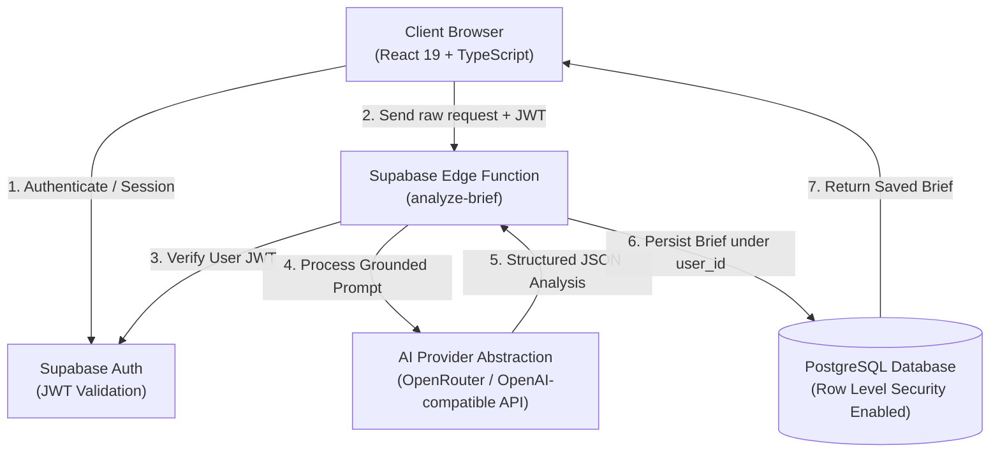

# AI Client Brief Assistant

[](https://github.com/emioj89/ai-client-brief-assistant/actions/workflows/ci.yml)


AI-powered SaaS tool that transforms raw client requests into structured technical project briefs.

[**Live Demo**](https://emioj89.github.io/ai-client-brief-assistant/) | [**GitHub Repository**](https://github.com/emioj89/ai-client-brief-assistant)

---

## Overview

Freelancers and agencies frequently receive unstructured, ambiguous project inquiries via email, chat, or form submissions. Synthesizing these requests into actionable proposals requires hours of manual scoping and scoping risk management.

**AI Client Brief Assistant** automates the initial technical triage. By processing raw client text through a server-side AI pipeline, it generates comprehensive, structured project briefs covering:

- **Executive Summary**: High-level overview of the scope.
- **Business Objectives**: Key goals driving the request.
- **Functional & Non-Functional Requirements**: Explicit features and technical constraints.
- **Missing Questions**: Critical scope, architectural, and budget gaps requiring clarification.
- **Technical Tasks**: Initial engineering task breakdown.
- **Risks & Assumptions**: Technical assumptions and potential implementation bottlenecks.
- **Complexity Assessment**: Low / Medium / High rating based strictly on confirmed initial scope.
- **Implementation Phases**: Milestone roadmap separating MVP deliverables from future phases.
- **Client Response Draft**: Professional draft acknowledging the request and seeking clarification.

> *Note: This application accelerates initial technical scoping and client communication; it is designed to assist, not replace, human engineering judgment.*

---

## Features

- **Authentication**: Secure Email/Password registration and sign-in powered by Supabase Auth.
- **Protected Routing**: Navigation guards ensuring secure access to dashboard and analysis tools (`ProtectedRoute` and `PublicOnlyRoute`).
- **AI-Powered Analysis**: Instant conversion of unstructured text into structured technical briefs.
- **Requirement Grounding**: Strict separation between confirmed client requests, technical assumptions, and unconfirmed future features.
- **Dashboard & History**: Centralized view of all analyzed briefs with complexity KPI breakdown (Total Briefs, Low, Medium, and High complexity counters).
- **Search & Filtering**: Real-time filtering by project title, client name, or complexity tier.
- **Detailed Scoping View**: Full breakdown of technical deliverables, risks, task lists, and phase milestones.
- **Client Communication Helper**: One-click copyable email draft to respond to client inquiries immediately.
- **Brief Management**: Ability to manage and delete obsolete or test briefs.
- **Responsive Interface**: Mobile-friendly layout designed for seamless use across desktop and mobile devices.

---

## Preview

<!-- Add production screenshot here -->
<!--

-->

---

## Architecture

The system follows a decoupled, security-first serverless architecture:



### Key Architectural Flow
1. **Frontend**: React SPA hosted on GitHub Pages handles UI state, authentication context, and brief visualization.
2. **Authentication**: Supabase Auth issues JWT tokens verified on API calls.
3. **Serverless AI Pipeline**: Requests are routed to a Supabase Edge Function (`analyze-brief`). The Edge Function validates authorization, injects strict grounding system prompts, and handles AI provider communication server-side.
4. **Data Isolation**: PostgreSQL with strict Row Level Security (RLS) policies ensures users can only access and modify their own briefs (`auth.uid() = user_id`).

---

## AI Grounding & Requirement Safety

A common failure mode in AI-assisted project estimation is "hallucinated scope"—where models convert reasonable assumptions into confirmed client requirements (e.g., automatically adding payment gateways, inventory engines, or compliance standards when the client only requested a simple catalog).

AI Client Brief Assistant enforces strict **grounding and anti-inference rules**:

- **Confirmed Scope Only**: `functionalRequirements` and `nonFunctionalRequirements` contain ONLY features explicitly mentioned or literally required.
- **Assumptions Isolation**: Unconfirmed technical details (payment providers, shipping logic, inventory engines, hosting constraints) are placed strictly into `risksAndAssumptions`.
- **Missing Questions**: Architectural, budget, and scope ambiguities are converted into actionable questions under `missingQuestions`.
- **Future Scope Separation**: Requests containing phrases like "later", "in the future", or "eventually" are isolated into future scope phases and not treated as part of the initial MVP.
- **Prompt Injection Defense**: Client input is isolated as untrusted content and system-level instructions are used to reduce prompt-injection risk.

---

## Security

- **Server-Side API Key Storage**: AI API keys (`AI_API_KEY`) and endpoints are configured exclusively inside Supabase Edge Function secrets and are never exposed to the client bundle.
- **No Service-Role Leakage**: Frontend uses only `VITE_SUPABASE_URL` and `VITE_SUPABASE_PUBLISHABLE_KEY`. No secret or service-role keys are used in the web application.
- **Row Level Security (RLS)**: Public tables (`briefs`) have RLS enabled with explicit policy grants restricted to `authenticated` users matching `(select auth.uid()) = user_id`. Anonymous access (`anon`) is revoked.
- **JWT Verification**: Edge functions verify user authenticity via Supabase Auth JWT headers before executing analysis or database writes.
- **Untrusted Content Handling**: Client request payloads are treated strictly as unverified data to prevent prompt injection attacks.

---

## Tech Stack

- **Frontend**: React 19, TypeScript (~6.0), Vite (~8.3), React Router 7 (`HashRouter`)
- **Backend & Database**: Supabase Auth, PostgreSQL, Row Level Security (RLS)
- **Serverless Runtime**: Deno / Supabase Edge Functions (`analyze-brief`)
- **AI Integration**: OpenAI-compatible API abstraction (routed via OpenRouter in production)
- **Quality & Testing**: Vitest, Oxlint, TypeScript strict mode
- **CI/CD & Hosting**: GitHub Actions (CI & Deployment), GitHub Pages

---

## Project Structure

```text
ai-client-brief-assistant/
├── .github/
│   └── workflows/          # GitHub Actions (CI and GitHub Pages Deploy)
│       ├── ci.yml
│       └── deploy.yml
├── src/
│   ├── components/         # Auth guards, Layout, UI components & KPI cards
│   ├── context/            # AuthContext provider
│   ├── hooks/              # Custom React hooks (useBriefs)
│   ├── lib/                # Supabase client initialization & configuration checks
│   ├── pages/              # Application views (Login, Register, Dashboard, NewBrief, Detail)
│   ├── services/           # Data layer for Supabase operations
│   ├── types/              # TypeScript interfaces and data models
│   └── utils/              # Parsing, formatting, stats calculation & unit test suites
├── supabase/
│   ├── functions/          # Serverless Edge Functions (analyze-brief)
│   ├── README.md           # Edge Function & Database deployment setup guide
│   └── schema.sql          # Database table definition, RLS policies & triggers
├── index.html
├── vite.config.ts          # Vite configuration with base path setting
└── package.json
```

---

## Local Development

### Prerequisites
- Node.js 24+
- npm 10+

### Setup Steps

1. **Clone the repository**:
   ```bash
   git clone https://github.com/emioj89/ai-client-brief-assistant.git
   cd ai-client-brief-assistant
   ```

2. **Install dependencies**:
   ```bash
   npm install
   ```

3. **Configure Environment Variables**:
   Create a local environment file:
   ```bash
   # Linux / macOS
   cp .env.example .env.local

   # Windows (PowerShell)
   Copy-Item .env.example .env.local
   ```

   Update `.env.local` with your Supabase credentials:
   ```env
   VITE_SUPABASE_URL=https://your-supabase-project.supabase.co
   VITE_SUPABASE_PUBLISHABLE_KEY=sb_publishable_your_key_here
   ```

   > *Note: Do NOT add `AI_API_KEY`, `AI_API_URL`, or `AI_MODEL` to `.env.local`. Those secrets belong exclusively to Supabase Edge Function Secrets.*

4. **Start the Development Server**:
   ```bash
   npm run dev
   ```

---

## Supabase Setup

To deploy your own backend instance:

1. **Database Schema**: Execute `supabase/schema.sql` in your Supabase SQL Editor to create the `briefs` table, indexes, update triggers, and RLS policies.
2. **Edge Function Deployment**:
   ```bash
   npx supabase functions deploy analyze-brief
   ```
3. **Configure Edge Function Secrets**:
   ```bash
   npx supabase secrets set AI_API_KEY="your-openrouter-or-openai-api-key"
   npx supabase secrets set AI_API_URL="https://openrouter.ai/api/v1/chat/completions"
   npx supabase secrets set AI_MODEL="your-model-id"
   ```
   *(Note: The Edge Function communicates via an OpenAI-compatible HTTP chat completions endpoint; the exact model ID depends on your chosen AI provider).*
4. **Auth Settings**: In the Supabase Dashboard under Auth Settings, add your site URL (e.g., `https://emioj89.github.io/ai-client-brief-assistant/`) to Redirect URLs.

---

## Testing & Quality

Run the automated test suite and code quality tools:

```bash
# Run unit tests (Vitest)
npm run test

# Run code linter (Oxlint)
npm run lint

# Verify production build
npm run build
```

**Status**: 20 automated tests passing across 4 test suites covering brief stats, analysis parsing, filter logic, and text formatters.

---

## CI/CD Pipeline

The repository includes two GitHub Actions workflows:

- **CI (`.github/workflows/ci.yml`)**: Triggered on push and pull requests to `main`. Runs `npm ci`, `npm run lint`, `npm run test`, and `npm run build` using Node 24.
- **Deploy (`.github/workflows/deploy.yml`)**: Triggered on push to `main`. Builds the Vite production bundle injecting public Supabase environment variables from repository secrets and deploys the `./dist` artifact to GitHub Pages.

---

## Roadmap

Future planned enhancements:

- [ ] Export brief analyses to PDF and Markdown formats.
- [ ] Editable generated brief fields prior to saving.
- [ ] Customizable industry project templates (E-commerce, Mobile App, SaaS MVP).
- [ ] Team collaboration & public brief sharing links.
- [ ] OAuth provider integration (GitHub, Google Sign-In).

---

## Author

**Emiliano Ostellino**

- **GitHub**: [@emioj89](https://github.com/emioj89)
- **Profile**: AI-Assisted Developer | React Native · TypeScript · JavaScript · Automation
